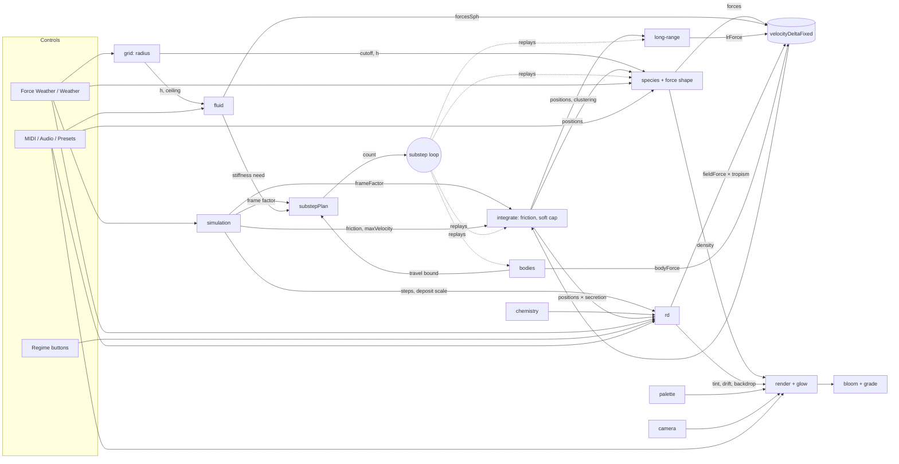

# Slider interactions

The graph of every slider and non-slider control: what each writes, what it
couples to, what it costs, and how well its range is calibrated. Citations
are `path:line` from the repository root.

## 1. Nodes

### Sliders (53, from `src/ui/api/param_descriptor.nim:405-819`)

| Group | id (label) | Writes | Dims when |
|---|---|---|---|
| simulation | `particleCount` (Particles) | particle buffers; commit resizes, new particles take a random species | — |
| simulation | `speciesCount` (Species) | matrix rows/columns, per-species chemistry, LR mesh depth | — |
| simulation | `friction` (Friction) | integrate retention `1 - friction` (`src/app.nim:191`) | — |
| simulation | `timeScale` (Time Scale) | `dt = cappedDt·timeScale` (`src/app.nim:239-241`) | — |
| simulation | `maxVelocity` (Max Velocity) | integrate soft cap; glow speed norm | — |
| simulation | `forceWeatherSpeed` (Force Drift) | Force Weather tour rate | — |
| grid | `interactionRadius` (Interaction Radius) | neighbour cutoff, grid cell size | — |
| species | `forceStrength` (Force Strength) | `fMul` in the neighbour sweep | — |
| species | `crowdingStrength` (Crowding) | attraction attenuation by density | forceOff |
| species | `ruleWildness` (Wildness) | spread of the next randomized matrix | — |
| render | `particleSize` (Particle Size) | `baseSize = particleSize + 1` | — |
| render | `trailLength` (Trail Length) | fade amount, velocity elongation | — |
| glow | `glowIntensity` (Intensity) | halo brightness | — |
| glow | `velocityGlowScale` (Velocity Sweep) | speed term of halo size and brightness | — |
| glow | `glowRadiusScale` (Halo Radius) | halo radius multiplier | — |
| glow | `glowFalloff` (Halo Falloff) | halo edge | — |
| glow | `glowWarmth` (Warmth) | density-weighted warm tint | — |
| bloom | `bloomIntensity` (Bloom Intensity) | bloom fold-back in tonemap | bloomOff |
| bloom | `exposure`, `saturation`, `contrast`, `temperature` | `tonemapGrade` (both paths, section 8) | bloomOff |
| force-polynomial | `repulsionEnd`, `attractionPeak` | joints of the polynomial curve | forceOff |
| force-exponential | `expRepulsionAlpha` (Repulsion α), `expAttractionBeta` (Attraction β) | decay rates of the two exponentials | forceOff |
| palette | `paletteSaturation`, `paletteLightness` | generated species colours | — |
| fluid | `fluidStrength` (Fluid) | SPH output multiplier | — |
| fluid | `sphRadiusFraction` (Fluid Scale) | `h = interactionRadius·fraction` | fluidOff |
| fluid | `sphRestDensity` (Rest Density) | Tait reference density | fluidOff |
| fluid | `sphStiffness` (Stiffness) | Tait stiffness, clamped by a derived ceiling | fluidOff |
| fluid | `sphViscosity` (Viscosity) | XSPH term | fluidOff |
| long-range | `longRangeStrength` (Long Range) | LR force scale; gates the solve | — |
| long-range | `longRangeReach` (Reach, log travel) | screening length | longRangeOff |
| long-range | `longRangeGridIndex` (Mesh Size) | mesh resolution | longRangeOff |
| rd | `rdFeed` (Breath In), `rdKill` (Breath Out) | Gray-Scott feed/kill | fieldSubcritical |
| rd | `rdDeposit` (Secretion Rate) | particle deposit into the field | — |
| rd | `rdFieldForce` (Scent-following) | field-gradient impulse scale | — |
| rd | `climateSpeed` (Drift) | Weather tour rate | — |
| rd-field | `fieldOpacity` (Field Opacity) | backdrop scale | fieldUnlit |
| bodies | `bodiesStrength` (Bodies) | body force multiplier | — |
| bodies | `bodyRadius`, `bodyBand`, `bodyProximity`, `bodyEnclosure`, `bodyLifetime` | the next body's shape and life | — (none) |
| bodies | `bodyIgnitionRate` (Wild Bodies) | autonomous ignition rate | — |
| chemistry | `secretion` (per species) | species share of deposit | depositOff |
| chemistry | `tropism` (per species) | species response to field force | tropismOff |
| camera | `cameraZoom` (Zoom) | live view scale (psCamera) | — |
| camera | `cameraDriftSpeed` (Drift Speed) | drift pan rate | cameraDriftOff |

Nine dormancy predicates live at `src/ui/api/dormancy.nim:28-62`. Each reads
one value against zero, except `fieldSubcritical`, which reads alive cells
and `F < 4(F+k)²`, and `fieldUnlit`, which reads alive cells only.

### Non-slider controls

| Control | Rank / kind | Writes | Citation |
|---|---|---|---|
| Force Weather (tour) | rkTour | forceStrength, interactionRadius, friction | `src/climate_core.nim:154-158` |
| Weather (RD tour) | rkTour | rdFeed, rdKill along `RD_REGIMES` | `src/climate_core.nim:89-92,107-117` |
| Regime buttons | rkFire | rdFeed, rdKill; raise-only rdDeposit floor | `src/web_api.nim:620-638` |
| New Rules (randomize) | action | matrix, spread ±0.33 scaled by wildness | `src/web_api.nim:316-324`, `src/ui/state/matrix_state.nim:108-118` |
| Force Model | toggle | forces.wgsl model branch; which shape group shows | `web/shaders/src/forces.wgsl:233-280` |
| Field Colormap | selector | colormapIndex: particle tint, backdrop, coverage | `src/web_api.nim:384-387` |
| Bloom, Trails, Drift toggles | toggles | bloomOff dormancy; Trails lifts length 0→25; cameraDriftOff | `src/ui/state/render_state.nim:60-70` |
| Palette scheme | selector | species colours; Open Color ignores both sliders | `src/palette.nim:141-164` |
| Audio | rkModulate | onset/loudness→forceStrength, bass→fluidStrength, high→glowIntensity (depth 0) | `src/ui/input/shipped_mapping.nim:172-181` |
| MIDI | rkWrite | CC7→forceStrength, CC1→fluidStrength, CC74→rdFieldForce, CC71→rdDeposit; PC→regimes; pads; tours | `src/ui/input/shipped_mapping.nim:147-168` |
| Presets | restore | every slider and colormapIndex (snapshot at `src/web_api.nim:1094`, restore at `1246`) | `src/web_api.nim:1246` |
| Wheel / keys / drag | camera | zoom at cursor, pan; mouse reach scales `/zoom` | `src/app.nim:205-211` |

Rank arbitration: rkWrite takes over softly; rkTour overwrites a drag on
the next frame; rkModulate moves only the effective copy through
`mirrorModulated` (`src/ui/input/control_matrix.nim:975-1030`,
`src/web_api.nim:825-840`).

### Shared nodes (not sliders)

- **velocity delta**: `velocityDeltaFixed`, cleared per substep
  (`src/sim_registry.nim:355-372`). Five writers: forces, forcesSph,
  fieldForce, bodyForce, lrForce.
- **integrate**: `(vel + delta)·friction`, then a log soft cap above
  `maxVelocity·0.5` and a hard cap at `maxVelocity` (`web/shaders/src/integrate.wgsl:87-100`).
- **substep loop**: `min(max(n_ff, n_T, n_c), SUBSTEPS_MAX)`, the integrator's
  own count from `substepPlan` (`src/sim_registry.nim:726-776`), called every
  frame whatever acts (`src/webgpu_compute.nim:987-1004`); the executor replays
  every per-substep node (`src/webgpu_compute.nim:1248-1254`). `n_ff` follows
  the frame factor, `n_T` the travel bound a live body declares, and `n_c` an
  acting coupling's own declared need — the fluid's stiffness is the only one.
- **crowd density**: computed in the forces pass
  (`web/shaders/src/forces.wgsl:312-316`), read by crowding, render size
  and glow warmth.
- **RD field**: once per frame (`src/sim_registry.nim:424-460`).

## 2. Edge kinds

| Kind | Meaning |
|---|---|
| **mul** | Factors of one term: zero in either silences the product. |
| **shape** | A reshapes the curve or kernel B scales. |
| **sum** | Both add into the velocity delta; they meet only through integrate (friction, soft cap). |
| **gate** | A's value switches a pass or B's dimming (dormancy or a code guard). |
| **bound** | A enters B's ceiling or floor. |
| **time** | A's time convention scales B per frame. |
| **cost** | A changes the GPU time of B's pass. |
| **write** | A writes B's stored or effective value (tour, regime, MIDI, audio, preset). |
| **visual** | A's physical state shows through B's render. |
| **absent** | An edge a reader could expect and the code lacks. |

## 3. Edge table

| # | A — B | Kind | Mechanism | Citation |
|---|---|---|---|---|
| 1 | particleCount — every compute pass | cost | per-particle dispatch; physics 0.15-0.19 ms at 16k, 1.05-1.11 ms at 128k | section 6 |
| 2 | particleCount — species mix | write | resize keeps particles; new ones draw a random species over speciesCount | `src/app.nim:130-158`, `src/web_api.nim:891-904` |
| 3 | particleCount — rdDeposit | mul | every particle deposits | `web/shaders/src/field-deposit.wgsl:75` |
| 4 | speciesCount — matrix | shape | reinit adds/removes rows and columns | `src/web_api.nim:389-396` |
| 5 | speciesCount — longRangeGridIndex | cost | `lrCells = w·h·speciesCount` | `src/webgpu_compute.nim:949-952` |
| 6 | speciesCount — secretion, tropism | shape | one value per species | `src/webgpu_compute.nim:1076-1081` |
| 7 | friction — five velocity writers | sum | retention on `vel + delta` | `web/shaders/src/integrate.wgsl:87-100` |
| 8 | maxVelocity — five velocity writers | sum | log soft cap above half | `web/shaders/src/integrate.wgsl:87-100` |
| 9 | maxVelocity — velocityGlowScale | visual | `velNorm = speed/maxVelocity` | `web/shaders/src/glow.wgsl:89-90`, `src/webgpu_render.nim:1679` |
| 10 | maxVelocity — substep count | bound | `n_T = ceil(maxVelocity·ff / T)` holds per-step travel inside the band; past `SUBSTEPS_MAX` the plan clamps the effective Max Velocity instead. `BODY_BAND_MIN` is a stated 25.0 and derives from nothing | `src/sim_registry.nim:726-776`, `src/config_ranges.nim:502-507` |
| 11 | timeScale — forceStrength | time | integrate multiplies the summed delta by `frameFactor` | `web/shaders/src/integrate.wgsl:59-60`, `src/webgpu_compute.nim:1042` |
| 12 | timeScale — fluid (pressure, viscosity) | time | integrate multiplies the summed delta by `frameFactor` | `web/shaders/src/integrate.wgsl:59-60`, `src/webgpu_compute.nim:1042` |
| 13 | timeScale — sphStiffness | bound | ceiling ÷ `(timeScale/60)` | `src/ui/api/param_descriptor.nim:240-253` |
| 14 | timeScale — rdFeed, rdKill | time, cost | RD steps per frame, odd, cost `1 + steps` | `src/field_core.nim:184-197` |
| 15 | timeScale — rdDeposit | time | `depositFrameScale(activeRdSteps)` | `src/webgpu_compute.nim:1051-1066` |
| 16 | timeScale — rdFieldForce | time | integrate multiplies the summed delta by `frameFactor` | `web/shaders/src/integrate.wgsl:59-60`, `src/webgpu_compute.nim:1042` |
| 17 | timeScale — longRangeStrength | time | integrate multiplies the summed delta by `frameFactor` | `web/shaders/src/integrate.wgsl:59-60`, `src/webgpu_compute.nim:1042` |
| 18 | timeScale — bodiesStrength | time | integrate multiplies the particle's delta by `frameFactor`, body-integrate the reaction by `frames` | `web/shaders/src/integrate.wgsl:59-60`, `src/webgpu_compute.nim:1042`, `web/shaders/src/body-integrate.wgsl:68-72`, `src/webgpu_compute.nim:1098` |
| 19 | timeScale — tours, drift, audio, bodies' clock | absent | all advance on `cappedDt`, not scaled time | `src/app.nim:244-274` |
| 20 | forceWeatherSpeed — forceStrength, interactionRadius, friction | write | rkTour | `src/climate_core.nim:154-158` |
| 21 | interactionRadius — forceStrength | shape, cost | cutoff; `cellSize = max(r,16)`; 5-cell loop | `web/shaders/src/forces.wgsl:106-107,141,210-214`, `src/grid_core.nim:39` |
| 22 | interactionRadius — force shape (4 sliders) | shape | `normalizedDist = d/r` | `web/shaders/src/forces.wgsl:210-214` |
| 23 | interactionRadius — crowdingStrength | shape | density counted inside the radius | `web/shaders/src/forces.wgsl:312-316` |
| 24 | interactionRadius — sphRadiusFraction | mul | `h = r·fraction` | `web/shaders/src/forces-sph.wgsl:115` |
| 25 | interactionRadius — sphStiffness | bound | ceiling ∝ `r·fraction` | `src/ui/api/param_descriptor.nim:240-253` |
| 26 | forceStrength — crowding, force shape (5 sliders) | gate, mul | forceOff dims them; `fMul` scales the whole curve | `src/ui/api/dormancy.nim:36-37`, `web/shaders/src/forces.wgsl:282-283` |
| 27 | forceStrength — fluidStrength | sum | the Hermite `-1` core is the only incompressibility while fluid sits at its default 0 | `web/shaders/src/forces.wgsl:243-247` |
| 28 | forceStrength — longRangeStrength | cost | +12-28 ms physics at 128k in 2 of 3 seeds; seed variance exceeds it | `scratchpad/dev/tracer-reports/4.md:53` |
| 29 | crowdingStrength — expAttractionBeta | gate | exponential crowding applies only where attraction > 0 | `web/shaders/src/forces.wgsl:73-78` |
| 30 | crowdingStrength — attraction | mul | `1/(1+s·ln(1+ρ))` | `web/shaders/src/forces.wgsl:91-93,133-134` |
| 31 | ruleWildness — matrix (via New Rules) | write | spread of the next roll only | `src/web_api.nim:316-324` |
| 32 | ruleWildness — Force Weather | absent | waypoints exclude wildness | `src/config_ranges.nim:140-176` |
| 33 | repulsionEnd — attractionPeak | shape | two joints of one curve | `web/shaders/src/forces.wgsl:233-262` |
| 34 | expRepulsionAlpha — expAttractionBeta | shape | difference of two exponentials | `web/shaders/src/forces.wgsl:73-78` |
| 35 | Force Model — both shape groups | gate | model branch | `web/shaders/src/forces.wgsl:233-280` |
| 36 | matrix — longRangeStrength | shape | the LR kernel reads the same matrix | `web/shaders/src/lr-kernel.wgsl:10-11,67-68` |
| 37 | fluidStrength — four fluid sliders | gate, mul | fluidOff; one multiplier over pressure and viscosity | `src/ui/api/dormancy.nim:39-40`, `web/shaders/src/forces-sph.wgsl:274-278` |
| 38 | sphStiffness — substep count | bound | an acting fluid declares `n_c = ceil(sphStiffness·ff / (0.3·h))`; the frame runs the largest of the three asks | `src/sim_registry.nim:749-766` |
| 39 | substep count — every per-substep writer | time, cost | `substepDt`; forces, SPH, field force, LR force, bodies and integrate replay | `src/webgpu_compute.nim:1002-1004,1248-1254` |
| 40 | substep count — sphStiffness | bound | the panel's ceiling is evaluated at `SUBSTEPS_MAX`, the count the plan serves a fluid that needs it | `src/ui/api/param_descriptor.nim:240-253`, `src/sim_registry.nim:762-766` |
| 41 | sphRadiusFraction — sphStiffness | bound | ceiling ∝ `r·fraction` | `src/ui/api/param_descriptor.nim:240-253` |
| 42 | sphRestDensity — sphStiffness | mul | Tait `k·((ρ/ρ0)^7 - 1)` | `web/shaders/src/forces-sph.wgsl:130-144` |
| 43 | sphViscosity — fluidStrength | mul | `(visc + 0.5)·fluidStrength` | `web/shaders/src/forces-sph.wgsl:262,274-278` |
| 44 | fluidStrength — longRangeStrength | cost | fluid declusters; physics per substep ~3× lower | section 6 |
| 45 | longRangeStrength — reach, mesh size | gate | longRangeOff; `acts()` skips the solve | `src/ui/api/dormancy.nim:42-43`, `src/sim_registry.nim:409-417` |
| 46 | longRangeReach — longRangeGridIndex | shape | reach resolves in cells (half per axis on the coarse mesh); softening 1.5 cells | `src/ui/api/response_probe.nim:298-313`, `src/long_range_core.nim:113-141` |
| 47 | longRangeStrength — neighbour sweep (particleCount, interactionRadius) | cost | clustering fills cells the sweep walks | `web/shaders/src/forces.wgsl:141,193`, section 6 |
| 48 | rdFeed — rdKill | shape, gate | pattern pair; fieldSubcritical | `src/ui/api/dormancy.nim:28-31,57-62` |
| 49 | Regime buttons — rdFeed, rdKill, rdDeposit | write | rkFire; deposit floor raise-only | `src/web_api.nim:620-638` |
| 50 | climateSpeed — rdFeed, rdKill | write | rkTour | `src/climate_core.nim:89-92,107-117` |
| 51 | rdDeposit — secretion | mul, gate | product per species; depositOff; the deposit node gated on deposit | `web/shaders/src/field-deposit.wgsl:83-85`, `src/sim_registry.nim:424-460` |
| 52 | rdFieldForce — tropism | mul, gate | product per species; tropismOff | `web/shaders/src/field-force.wgsl:66-84`, `src/ui/api/dormancy.nim:48-49` |
| 53 | rdFeed/rdKill (alive cells) — fieldOpacity | gate | fieldUnlit | `src/ui/api/dormancy.nim:54-55` |
| 54 | RD field — particle colour | visual | tint at `FIELD_LIGHT_STRENGTH`, ignores fieldOpacity | `web/shaders/src/render.wgsl:176-194` |
| 55 | RD field — trailLength | visual | trails drift along the inhibitor gradient, only when trails are on | `web/shaders/src/fade.wgsl:88-94`, `src/webgpu_render.nim:1821` |
| 56 | fieldOpacity — bloomIntensity path | visual | `light = trail + bloom·bloomIntensity + fieldLight` | `web/shaders/src/tonemap.wgsl:74-89` |
| 57 | fieldOpacity — exposure, saturation, contrast, temperature | visual | bloom-off backdrop graded by `tonemapGrade` | `web/shaders/src/field-composite.wgsl:60-68`, `src/webgpu_render.nim:1973-1982` |
| 58 | Field Colormap — fieldOpacity, particle tint | shape | one colormapIndex feeds both | `src/web_api.nim:384-387`, `web/shaders/src/render.wgsl:190-193` |
| 59 | RD — fluid, LR, bodies, crowding | absent | no term reads the field besides field force and render | `src/sim_registry.nim:424-470` |
| 60 | bodiesStrength — six body sliders | absent | no dormancy predicate on the group | `src/ui/api/param_descriptor.nim:733-790` |
| 61 | bodyRadius, bodyBand, bodyProximity, bodyEnclosure, bodyLifetime — living bodies | absent | disposition frozen at ignition | `src/webgpu_compute.nim:213-218` |
| 62 | bodyIgnitionRate — bodyLifetime | mul | standing count `min(rate·lifetime, 32)` | `src/ui/api/response_probe.nim:558-562` |
| 63 | bodyIgnitionRate — bodiesStrength | absent | ignition never reads strength | `src/body_core.nim:607-622` |
| 64 | bodyProximity — bodyEnclosure | sum | both act inside the band | `web/shaders/src/body-force.wgsl:127-141` |
| 65 | bodyBand — bodyRadius | shape | band measured from the surface | `web/shaders/src/body-force.wgsl:127-141` |
| 66 | particles — bodies | sum | particle reaction moves bodies | `web/shaders/src/body-force.wgsl:149-156` |
| 67 | particleSize — glowRadiusScale | mul | halo radius = `(size+1)·glowRadiusScale·(1+…)`; default pin 12 | `web/shaders/src/glow.wgsl:96-103`, `src/ui/state/render_state.nim:72-86` |
| 68 | particleSize — crowd density | visual | `sizeMod` by density | `web/shaders/src/render.wgsl:55-59,102-104` |
| 69 | trailLength — Trails toggle | write | on lifts 0 → 25 | `src/ui/state/render_state.nim:60-70` |
| 70 | trailLength — particle speed | visual | elongation along velocity | `web/shaders/src/render.wgsl:108-131` |
| 71 | cameraZoom — particleSize, trailLength, glowRadiusScale | shape | shared zoom path | `web/shaders/modules/camera_transform.wgsl:98-101` |
| 72 | cameraZoom — mouse reach | shape | `mouseRange / zoom` | `src/app.nim:205-211` |
| 73 | cameraDriftSpeed — cameraZoom | write | drift breathes the zoom | `src/camera_drift.nim:171` |
| 74 | glowIntensity — velocityGlowScale | mul | intensity inside the velocity factor | `web/shaders/src/glow.wgsl:162-163` |
| 75 | velocityGlowScale — glowRadiusScale | mul | radius × `(1 + velNorm·vgs·0.5)` | `web/shaders/src/glow.wgsl:96-103` |
| 76 | glowFalloff — glowIntensity | shape | alpha edge | `web/shaders/src/glow.wgsl:167-168` |
| 77 | glowWarmth — crowd density | mul | `warmth·density` | `web/shaders/src/glow.wgsl:173-176` |
| 78 | palette — glow tint | visual | halo tint from species colour | `web/shaders/src/glow.wgsl:105-106` |
| 79 | glowIntensity — bloomIntensity | mul | bloom folds the glow back | `web/shaders/src/tonemap.wgsl:74-89` |
| 80 | exposure → saturation → contrast → temperature | shape | fixed order after ACES | `web/shaders/modules/tonemap_grade.wgsl:1-44` |
| 81 | Palette scheme — paletteSaturation, paletteLightness | gate | Open Color (the default) ignores both; no dimming | `src/palette.nim:141-164`, `src/ui/state/palette_state.nim:39-48` |
| 82 | MIDI — forceStrength, fluidStrength, rdFieldForce, rdDeposit | write | CC7, CC1, CC74, CC71 | `src/ui/input/shipped_mapping.nim:147-154` |
| 83 | Audio — forceStrength, fluidStrength, glowIntensity | write | rkModulate; high→glow at depth 0 | `src/ui/input/shipped_mapping.nim:122-135,172-181` |
| 84 | Tours — dragged slider | write | rkTour overwrites the drag next frame | `src/ui/input/control_matrix.nim:975-1030` |

**Counts:** 54 slider nodes, 12 non-slider control nodes, 5 shared nodes;
84 edge rows (several rows name a group on one side).

## 4. Per-slider adjacency

Edge numbers from section 3.

| Slider | Edges |
|---|---|
| particleCount | 1, 2, 3, 47 |
| speciesCount | 2, 4, 5, 6 |
| friction | 7, 20 |
| timeScale | 11-19 |
| maxVelocity | 8, 9, 10 |
| forceWeatherSpeed | 20, 84 |
| interactionRadius | 20-25, 47 |
| forceStrength | 11, 20, 26, 27, 28, 82, 83 |
| crowdingStrength | 23, 26, 29, 30 |
| ruleWildness | 31, 32 |
| particleSize | 67, 68, 71 |
| trailLength | 55, 69, 70, 71 |
| glowIntensity | 74, 76, 79, 83 |
| velocityGlowScale | 9, 74, 75 |
| glowRadiusScale | 67, 71, 75 |
| glowFalloff | 76 |
| glowWarmth | 77 |
| bloomIntensity | 56, 79 |
| exposure, saturation, contrast, temperature | 57, 80 |
| repulsionEnd, attractionPeak | 22, 26, 33, 35 |
| expRepulsionAlpha, expAttractionBeta | 22, 26, 29, 34, 35 |
| paletteSaturation, paletteLightness | 78, 81 |
| fluidStrength | 12, 27, 37, 43, 44, 82, 83 |
| sphRadiusFraction | 24, 37, 41 |
| sphRestDensity | 37, 42 |
| sphStiffness | 13, 25, 37, 38, 40, 41, 42 |
| sphViscosity | 12, 37, 43 |
| substep count (integrator, not a slider) | 10, 38, 39, 40 |
| longRangeStrength | 17, 28, 36, 44, 45, 47 |
| longRangeReach | 45, 46 |
| longRangeGridIndex | 5, 45, 46 |
| rdFeed, rdKill | 14, 48, 49, 50, 53 |
| rdDeposit | 3, 15, 49, 51, 82 |
| rdFieldForce | 16, 52, 82 |
| climateSpeed | 50, 84 |
| fieldOpacity | 53, 56, 57, 58 |
| bodiesStrength | 18, 60, 63 |
| bodyRadius | 61, 65 |
| bodyBand | 10, 61, 65 |
| bodyProximity, bodyEnclosure | 61, 64 |
| bodyLifetime | 61, 62 |
| bodyIgnitionRate | 62, 63 |
| secretion | 6, 51 |
| tropism | 6, 52 |
| cameraZoom | 71, 72, 73 |
| cameraDriftSpeed | 73 |

## 5. Diagram

## 6. Cost layer

Conditions for every number below: Chromium 152.0.7977.82 headless, Apple
M5 Max; 45 s windows (60 s for extra seeds); min-max of the last four
`[gpu-profile]` lines; substep 0 only (`src/webgpu_compute.nim:1251`);
defaults n 16000, 4 species, radius 50, reach 600, mesh 512×256,
substeps 2. Logs: `scratchpad/cost-graph/runs/`, summarized in
`scratchpad/dev/tracer-reports/4.md`. The `physics` bucket is
binScatter + forces + forcesSph (`src/sim_registry.nim:389-395`) plus
integrate (`src/app.nim:308-309`).

| Configuration | physics ms | lr ms | Other |
|---|---|---|---|
| 16k, LR 0, force 1 | 0.148-0.191 | — | — |
| 16k, LR 0.5, force 0, fluid 0 | 3.085-3.667 | 0.139-0.185 | present 1.26-2.12, draw ~0.1 |
| 16k, LR 0.5, fluid 1 | 0.98-1.20 (per substep) | 0.26-0.32 | — |
| 128k, LR 0 | 1.05-1.11 | — | — |
| 128k, LR 0.5, force 0, seed 42 | 37-44.6 | 0.151-1.081 | present 7.8-13.8, grid ~0.02 |
| 128k, LR 0.5, force 0, seed 99 | 82-86 | — | — |
| 128k, LR 0.5, force 1, seed 99 | 125 → 161.8, still climbing | — | — |

Findings:

- **Long range is expensive with or without the species force.** Physics
  rises ×25 at 16k and ×35-80 at 128k while the solve itself stays at
  0.14-0.32 ms. The cost lands in the always-on neighbour sweep: LR
  clusters particles, and the sweep walks every particle in 5 cells per
  row (`web/shaders/src/forces.wgsl:141,193`), so per-particle work grows
  with cell occupancy. An in-app record shows physics climbing
  3.479 → 6.487 ms after the couplings were switched off, the clusters
  persisting (`scratchpad/long-range-mesh/in-app__13-09-26-1625.md:31-32`).
- Force Strength adds nothing measurable at 16k; at 128k it adds 12-28 ms
  in seeds 42 and 7, while seed 99 with force off (82-86 ms) exceeds both
  force-on runs, so the seed spread is larger than the force effect
  (`scratchpad/dev/tracer-reports/4.md:30-31,53`).
- Fluid declusters (per-substep physics ~3× lower under LR) but its stiffness
  can ask the plan for more substeps, and each extra substep replays every
  per-substep node (`src/webgpu_compute.nim:1248-1254`).
- Mesh size default measured 0.417-0.450 ms at 512×256×12
  (`src/config_ranges.nim:91-125`); `docs/perf-report.md:156` gives 0.459 ms
  at S=12. Mesh cost scales with speciesCount (edge 5).
- Bodies: 0.066-0.076 ms (`docs/perf-report.md:327-329`).
- RD cost follows timeScale: `1 + steps` passes (`src/field_core.nim:184-197`).

Unexplained or unmeasured:

- Present time rises 3-8× under LR. Halo quads grow with speed × Velocity
  Sweep (`web/shaders/src/glow.wgsl:96-103`); no run tests whether that is
  the cause (`scratchpad/dev/tracer-reports/4.md:58,107`).
- Under LR, Grid falls from 0.07-0.11 to 0.018-0.021 ms at 128k, and Field
  falls from 1.6-1.8 to 0.35-0.46 ms at 16k, though neither pass does less
  work (`scratchpad/dev/tracer-reports/4.md:109`). `docs/perf-report.md:114-126`
  records the same pattern for Field and leaves its cause open.
- lrForce and fieldForce have no profiler slot (`PROFILER_SLOT_NONE`,
  `src/sim_registry.nim:467-470,477-480`); their cost is unmeasured.
  The profile line carries no field bucket (`src/app.nim:62-64`).
- No run measures fill cost against halo quad size (particleSize ×
  glowRadiusScale × velocity) (`scratchpad/dev/tracer-reports/4.md:95`).
- 128k traces were still climbing when the window closed; the figures are
  lower bounds.

## 7. Calibration inventory

M = the source records a measurement with conditions; P = marked
provisional; B = blind visual pick; D = derived from other constants;
U = no statement either way.

| Slider / constant | Status | Citation |
|---|---|---|
| forceStrength 0-5 | U | `src/config_ranges.nim:37-43` |
| crowdingStrength max | P | `src/config_ranges.nim:48-56` |
| fluidStrength 0-1; "full strength untuned" | P | `src/config_ranges.nim:57-62`, `src/ui/state/simulation_state.nim:148-151` |
| longRangeStrength max | P | `src/config_ranges.nim:67-75` |
| longRangeReach range | U | `src/config_ranges.nim:76-90` |
| longRangeGridIndex default | M | `src/config_ranges.nim:91-125` |
| LR softening 1.5 cells | M | `src/long_range_core.nim:113-141` |
| matrix spread ±0.33 | P | `src/config_ranges.nim:128-132` |
| ruleWildness | U | `src/config_ranges.nim:135-139` |
| Force Weather waypoints | P | `src/config_ranges.nim:140-176` |
| forceWeatherSpeed default 0.5 | U (the source flags its own rationale as unsourced) | `src/climate_core.nim:177-182` |
| sphRadiusFraction min 0.1 | P; inert below h ≈ 2.5 px | `src/config_ranges.nim:215-245` |
| sphStiffness ceiling coefficient | M | `src/sph_core.nim:135-151` |
| SPH_FORCE_SCALE 3, MAX_PRESSURE_ACCEL 5000 | U | `src/sph_core.nim:38-54` |
| rdDeposit max | M | `src/config_ranges.nim:280-287` |
| rdDeposit default 0.02 | M | `src/field_core.nim:138,151-156` |
| HIGH_FEED_DEPOSIT 0.040, regime floors | M | `src/config_ranges.nim:305-319,343-347` |
| rdFieldForce default 7.5, max 37.5 | D (30/4; ×5) | `src/field_core.nim:157`, `src/config_ranges.nim:291-304` |
| pattern scale 9.30 cells, sqrt law, dies below 0.16 | M | `src/field_core.nim:232-245` |
| tropism max | M (collapse at 4.0) | `src/config_ranges.nim:420-475` |
| FIELD_LIGHT_STRENGTH 0.55, FIELD_DRIFT_SCALE 0.02 | B | `src/colormap_core.nim:61-84` |
| fieldOpacity default 0 | U | `src/colormap_core.nim:43-57` |
| bodyBand floor 25 | U (a stated literal; nothing derives it) | `src/config_ranges.nim:502-507` |
| bodiesStrength ceiling 1, BODY_FORCE_CEILING 10 | U | `src/body_core.nim:151-160` |
| glowRadiusScale × particleSize pin 12 | D | `src/ui/state/render_state.nim:72-86` |
| Trails lift to 25 | U | `src/ui/state/render_state.nim:60-70` |
| glow, bloom, grade, palette, camera sliders | U | `src/ui/api/param_descriptor.nim:488-521,543-551,811-829` |

The five velocity writers share one time unit: each hands integrate its
impulse per reference frame, and integrate alone multiplies the summed delta
by `frameFactor` (`web/shaders/src/integrate.wgsl:59-60`,
`src/webgpu_compute.nim:1042`). Their strength ranges are 0-5, 0-1,
0-37.5, provisional, and 0-1 × a ceiling of 10, so no slider position means
the same push in two systems.

## 8. Gap analysis

### "Long range runs expensive when particle force is also on"

Narrowed by the measurements: long range is expensive whether or not the
species force is on (16k: force 0 → physics 3.1-3.7 ms). The solve is cheap;
the neighbour sweep pays for the clusters LR builds (edge 47). Force Strength
adds to it at 128k by less than the seed-to-seed spread (edge 28,
`scratchpad/dev/tracer-reports/4.md:53`). The coupling that
drives the cost is LR → positions → cell occupancy → sweep, and no slider
exposes it: nothing bounds occupancy.

### "Reaction-diffusion has too little interaction with the rest"

Confirmed. RD reaches the rest through deposit (particles → field, edges
3, 51) and field force (field → velocity delta, edge 52), plus timeScale
(14-16), regimes, Weather and MIDI (49, 50, 82), and visuals (54-57). No
edge links RD to fluid, long range, bodies, crowding or the force shape
(edge 59). Field force defaults to 7.5 on its own gain scale (section 7).

### "Some particle forces seem unrelated to each other"

The five velocity writers meet only in integrate (edges 7, 8), each on its
own time convention and strength scale (section 7). Specific cases:

- Force Strength silently owns incompressibility through the Hermite
  core (edge 27); fluid is the named pressure system but defaults to 0.
- Long range shares the matrix (edge 36) but not Force Strength's gain or
  the force shape.
- Bodies act on particles and take their reaction (edge 66) with no link to
  species, fluid or field.
- Tropism links field force to species; no species term exists for fluid,
  long range or bodies.

### "Some links that should exist don't, and vice versa"

Missing:

- Bodies strength dims nothing, unlike Fluid and Long Range (edge 60).
- Wild Bodies ignite at strength 0 (edge 63).
- timeScale scales physics but not tours, drift or ignition (edge 19).
- Wildness is excluded from Force Weather (edge 32).
- Palette sliders stay undimmed while the default scheme ignores them
  (edge 81).

Present but arguably unwanted:

- The stiffness ceiling moves with Interaction Radius and Time Scale
  (edges 13, 25).
- The field tints particles and bends trails with no slider (edges 54, 55);
  both constants are blind picks.
- Tours overwrite a drag on the next frame (edge 84).

### "A lot of calibration is needed"

Section 7: six ranges marked provisional, the field's light and drift
constants blind picks, and every render, grade, palette and camera range
unmarked. Only RD, mesh size, SPH stiffness,
LR softening and tropism carry measurements.

### Doc-vs-code contradictions

| Claim | Code | Citation |
|---|---|---|
| `docs/help/10-simulation.md:9-11`: particleCount "rebuilds the population" | commit resizes; existing particles stay | `src/app.nim:130-158` |
| `docs/help/52-bloom.md:7-9` and `src/ui/api/param_descriptor.nim:504-506`: the five sliders act only with bloom on | the bloom-off backdrop runs `tonemapGrade`; live while Field Opacity > 0 | `web/shaders/src/field-composite.wgsl:60-68`, `web/shaders/modules/tonemap_grade.wgsl:6-8` |
| `docs/help/51-glow.md:10-11`: speed brightens | speed also grows the halo | `web/shaders/src/glow.wgsl:96-103` |
| `docs/help/53-palette.md`: sliders adjust every scheme | Open Color ignores both | `src/palette.nim:141-164` |
| `docs/help/50-render.md:9`: size is the radius drawn | drawn size is `(size+1)·sizeMod` | `web/shaders/src/render.wgsl:55-59,102-104` |
| `src/web_api.nim:318-319`: matrix in [-1, 1] | ±0.33 | `src/ui/state/matrix_state.nim:108-118` |

## Planned rewiring

[openspec/changes/core-force-interface/proposal.md](../openspec/changes/core-force-interface/proposal.md)
removes or rewires these edges:

- Removes the RD visuals and the Field Opacity and Colormap nodes: 53, 54,
  55, 56, 57, 58.
- Rewires the strengths onto one 0-1 calibrated contract, including Force
  Strength and Scent-following: 11-18, and section 7's unit mismatch.
- Moves incompressibility to world pressure; crowding becomes texture: 27, 30.
- Makes long range radius-scaled and mesh-independent: 46.
- Adds a Pattern Scale chemistry control and profiler slots for every
  contributor (section 6's unmeasured items).
